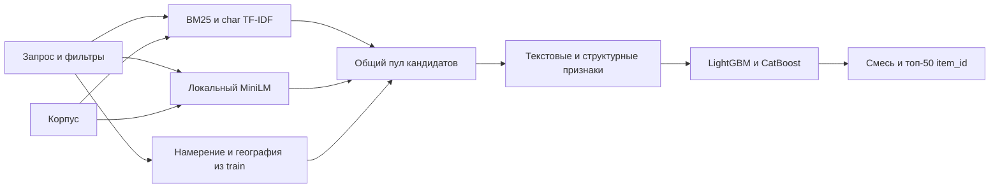

# Avito Service Retrieval

Кандидатогенерация объявлений услуг: для каждого запроса решение возвращает
50 уникальных `item_id`. Поиск и применение моделей работают локально,
без внешних inference API.

| Отправленный вариант | Recall@50 |
| --- | ---: |
| **Public benchmark**, результат платформы, сообщённый автором | **0.866246** |
| Локальная проверка: 1 500 отложенных запросов | 0.913667 |
| Локальная проверка: незнакомые тексты | 0.909574 |

Финальный ансамбль: **90% LightGBM LambdaRank + 10% CatBoost**, со
стандартизацией оценок внутри запроса. [answer.csv](answer.csv) содержит
2 452 строки, по 50 объявлений. Локальная метрика не заменяет public score.

## Точное воспроизведение

Требуется **Python 3.12**, CPU и примерно 4 GB свободной RAM. GPU не нужен.
Используются собственные модели из `checkpoints/` и замороженные признаки
из локального архива `reproduction-cache-v1.zip`, передаваемого проверяющему
отдельно от публичного репозитория.
В архиве признаков нет готовых ответов: скрипт заново применяет модели,
объединяет оценки и выбирает топ-50.

```bash
git clone https://github.com/IGK-arch/Avito-service-retrieval.git
cd Avito-service-retrieval
python -m venv .venv
```

Активируйте окружение: `source .venv/bin/activate` на Linux/macOS или
`.venv\Scripts\Activate.ps1` в PowerShell. Далее:

```bash
python -m pip install -r requirements.txt
# Архив задания положите в корень.
python src/extract_data.py --archive NLP_avito_interns.zip
```

Если данные уже извлечены, положите benchmark Parquet в `data/`.
Для применения моделей `train.parquet` не требуется.
Положите предоставленный отдельно `reproduction-cache-v1.zip` в корень:

```bash
python src/package_reproduction.py extract --archive reproduction-cache-v1.zip
python src/submit_best.py --output answer_reproduced.csv
python src/validate_answer.py --answer answer_reproduced.csv
```

Ожидаемый **SHA-256** воспроизведённого и отправленного файла:

```text
328a58d7b36c67930747079c8b0c04b0db26f27626b53a53abb331085311c1c1
```

При несовпадении скрипт завершится с ошибкой до замены итогового файла.
Переводы строк CSV зафиксированы как CRLF. Интернет нужен только для
подготовки зависимостей и файлов; само предсказание выполняется офлайн.
Подробности: [docs/reproduction.md](docs/reproduction.md).

## Подход



BM25 использует русские основы слов и биграммы, с отдельной нормализацией
заголовка, параметров и описания. Символьные n-граммы помогают при опечатках.
Frozen MiniLM дополняет текстовое сопоставление. История обучает мягкие
географические вероятности и перенос микро-категорий; дополнительно намерение
предсказывает Multinomial Naive Bayes. Объединённый пул оценивают две модели
по текстовым, географическим, числовым и структурным признакам.

`query_id` и `item_id` используются для соединения таблиц и записи ответа,
но не входят в признаки. Ручных ответов для конкретных запросов нет.
Данные, признаки и параметры: [docs/solution.md](docs/solution.md).

## Эксперименты

| Вариант | Локальный Recall@50 |
| --- | ---: |
| BM25 | 0.370944 |
| Символьный TF-IDF | 0.280984 |
| MiniLM без географии | 0.033222 |
| BM25 с географией | 0.798389 |
| Формульный гибрид | 0.836222 |
| CatBoost, глубина 6 / 8 / 9 | 0.897167 / 0.891833 / 0.895667 |
| LightGBM, 31 / 63 листа | 0.907667 / 0.907333 |
| LightGBM, глубина 9, 127 листьев | 0.908667 |
| **LightGBM / CatBoost, веса 0.9 / 0.1** | **0.913667** |

Потолок полноты исходного пула на локальном разбиении — 0.960167.
Модели и вес смеси выбирались по одной validation. Из обучающей истории
удалены взаимодействия с отложенными items и часть текстов. Корпус проверки
содержит benchmark и добавленные positives: плотность конкурирующих
объявлений может отличаться от реальной.

- [Валидация и исправления ошибок](docs/validation.md).
- [Журнал экспериментов](reports/experiments.md).
- [Анализ ошибок отправленного ансамбля](reports/error_analysis.md).

## Структура

```text
configs/submission.json       Рецепт ансамбля и контрольные суммы
checkpoints/                  Собственные обученные CatBoost и LightGBM
src/                          Исходники отдельных стадий с комментариями
tests/                        Проверки контрактов и целостности
docs/                         Описание данных, моделей и запуска
reports/                      Метрики и анализ экспериментов
answer.csv                    Отправленный результат
```

Канонический exporter — `src/submit_best.py`.
Роли модулей: [docs/code_map.md](docs/code_map.md).
Tiny, remote-признаки, резервирование исторических кликов и refit на всех
отложенных запросах не применялись в отправленном ансамбле.
Исходные данные и тяжёлые кэши не входят в Git history.

## Проверки кода

```bash
python -m pip install -r requirements-dev.txt
python -m ruff check src tests
python -m black --check src tests
python -m pytest
```

Основная интеграционная проверка — повторная генерация в чистой копии
репозитория с совпадением SHA-256 и проверкой всех требований CSV.

## Используемые open-source компоненты

Использованы open-source NumPy, pandas, PyArrow, CatBoost, LightGBM, SciPy,
scikit-learn, NLTK, PyTorch, Transformers и Sentence Transformers.
Версии, модель MiniLM и лицензии: [THIRD_PARTY.md](THIRD_PARTY.md).
